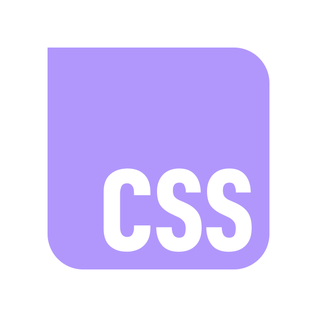
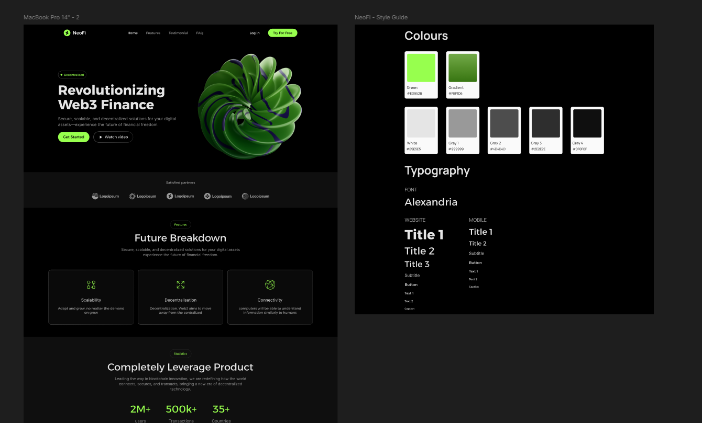
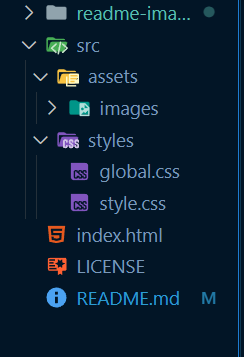

# NEOFI
Site desenvolvido a partir de seu template no figma. Foi feito para aplicar conhecimentos em HTML e CSS, e também para testar a responsividade com midias querys.

---

## Tecnologias Utilizadas

<div align="left">


</div>

---

## Etapas

1. **Observar o template no figma:**

    

2. **Começar a criar os arquivos:**

    

3. **Começar o `global.css`:**

    ```css
    *{
    margin: 0;
    padding: 0;
    box-sizing: border-box;
    border: none;
    background: none;
    text-decoration: none;
    }
    ........
    ```

4. **Começar o `index.html`:**

    ```html
        <!DOCTYPE html>
        <html lang="en">
        <head>
            <meta charset="UTF-8">
            <meta name="viewport" content="width=device-width, initial-scale=1.0">
            <title>NeoFi</title>
            <link rel="preconnect" href="https://fonts.googleapis.com">
            <link rel="preconnect" href="https://fonts.gstatic.com" crossorigin>
            <link href="https://fonts.googleapis.com/css2?family=Alexandria:wght@100..900&display=swap" rel="stylesheet">
            <link rel="stylesheet" href="./src/styles/style.css">
        </head>
        <body>
            ......
    ```

5. **Começar o `style.css`:**

    ```css
        @import url('./global.css');

        /* --------------------HEADER-------------------- */
        header{
            width: 100%;

            display: flex;
            justify-content: center;
            align-items: center;
            gap: 200px;

            padding: 20px 0;

            background-color: #000000;
        }
        .....
    ```

---

## Como contribuir

1. Fork o repositório
2. Criar sua branch
3. Fazer uma alteração ou issue
4. Fazer o pull request
5. Manter contato :)

---

## Conclusão

O projeto NeoFi colocou em prática meus conhecimentos em HTML e CSS, e aprimorou minha velocidade no desenvolvimento de um site.